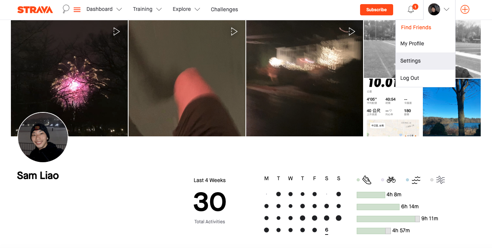
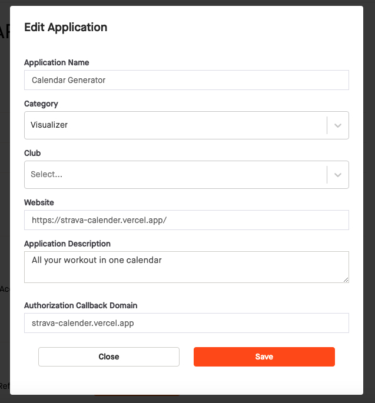
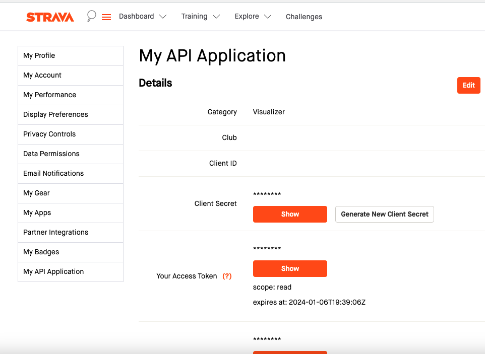

# Strava Calendar API

<em>The API enpowers the Strava Calendar application</em>

## Why do I build this project?

Strava Calendar API is the API that suppports Strava Calendar app to retrieve Strava personal data and plot the calendar. It is implemented in FastAPI. The background of this project can be found at [Strava Calendar](https://github.com/handsamtw/strava-calender).

### Example

1. Generate User ID

   Endpoint

   - URL: /uid
   - Method: GET

   Parameters

   - code (Query Parameter): Authorization code obtained from the redirect URL.

   Description

   While interacting with [Strava Calendar](https://github.com/handsamtw/strava-calender) app, users initiate the authorization process by clicking on the  button.

   This grants the application READ ALL access to their public Strava activities. Subsequently, Strava provides a code, which is utilized to request an `access_token` and `refresh_token`. The GET /uid endpoint is designed to store these credentials in the database and return a unique user identifier (ObjectID) for future reference.

   Response

   - Success (HTTP 200 OK):
     Content Type: JSON
     - Body: { "uid": "<user_id>" }
   - Failure (HTTP 400 Bad Request):
     - Body: "No code is found in the redirect URL. Access_token request denied" (if no code is provided)
     - Body: "credentials is not an instance of dict.\n Credentials:{credentials}" (if credentials is not a dictionary)

2. Generate Strava calendar

   Endpoint

   - URL: /calendar
   - Method: GET

   Parameters

   - uid (Query Parameter): User ID obtained from the /uid endpoint.

   Optional Parameters:

   | Optional Parameters | Options                                                                                      | Description                                                                                                                                                                                       |
   | ------------------- | -------------------------------------------------------------------------------------------- | ------------------------------------------------------------------------------------------------------------------------------------------------------------------------------------------------- |
   | `theme`             | Reds (default), Blues, Greens, BuGn, PuBu, RdPu, twilight, All                               | Theme for the calendar                                                                                                                                                                            |
   | `unit`              | imperial, metric                                                                             | Distance unit to calculate the stat of activity                                                                                                                                                   |
   | `sport_type`        | Ex: run, ride, swim, walk, hike, trail run, alpine ski, yoga, hiit, weight training, workout | The sport type to filter the activity                                                                                                                                                             |
   | `as_image`          | True, False (default)                                                                        | Flag to determine if the response should be an image, if set to False, will return a dictionary type as `{"image": {"theme1": 'base64_encoded_image1'}, {"theme2": 'base64_encoded_image2'}} ...` |

   Description

   The endpoint grab the `access_token` from database with provided uid -> check the token expiracy and refresh if required -> fetch strava activity -> summarize the activity -> plot calendar with given configuration

   Response

   - Success (HTTP 200 OK):
     If as_image is set to true:

     - Content Type: image/png
       Body: PNG image data
       Otherwise:
     - Content Type: JSON
     - Body: Array of encoded images or error message.

   - Failure (HTTP 400 Bad Request):

     - Body: "User id must be provided" (if no user ID is provided)
     - Body: "Invalid user id: {uid}" (if the provided user ID is invalid)
     - Body: "User wasn't found in the database. Check Strava authorization status" (if user not found in the database)
     - Body: "No activities found within the period" (if no activities found)

## Running for development locally

To setup up locally devloping environment of this backend API, here is the todo list

- [ ] Fork the repo and clone your forked repo to local environment
- [ ] Install Python dependencies
- [ ] Setup MongoDB Atlas
- [ ] Setup Strava developer credentials
- [ ] Add .env file to the root directory
- [ ] Run locally and make a curl request

### Setup MongoDB Atlas

1. Login to your MongoDB Atlass portal
2. Create New Organization(optional)
3. Create New Project within the organization
4. Navigate to Database at the left sidebar and click `Build a database`

5. Choose the M0 Free version and the region that is closest to your geological location
   
6. When MongoDB processes your request, add Username and Password to authenticate your connection with MongoDB. In addition, add entries to your IP Access List (Only an IP address you add to your Access List will be able to connect to your project's clusters)
7. After your cluster is built up, click `connect button`, visit Drivers tab and select Python as programming language
   

8. Follow the instruction you saw, copy the text of `mongodb+srv://<Your username>:{your password}@cluster0.<cluster name>.mongodb.net/?retryWrites=true&w=majority` and replace line below `# Connect to MongoDB` in api/index.py with your own credential
   

9. Navigate to database tab, click `browse collection`, and create your collection
   

10. Replace the name of database and collection in api/index.py if needed.

### Setup Strava developer credential

To make request to Strava API, there're three critical credential: CLIENT_ID, CLIENT_SECRET, ACCESS_TOKEN

1. Go to Strava settings page

   Login to your Strava account and hover to your icon at the top-right corner, click [settings](https://www.strava.com/settings/profile).

   

2. Create application

   Click [My API application](https://www.strava.com/settings/api) at the last tab of left sidebar.

   Fill the form belowed and set Authorization callback domain to <em>localhost:4200</em>

   

   Once you create your application, Strava will grant you devloper Client ID, Client Secret, and access token, which you will use later in .env file

    

3. Add .env file to the root directory

   The .env.example serves as a template for developers to understand the required environment variables without exposing any sensitive data.

   Replace ACCESS_TOKEN, REFRESH_TOKEN, and MONGODB_PASSWORD in .env.example file to your own credential. Then run `mv .env.example .env` to rename the file

### How to run the API endpoint locally

1. Virtual environment setup

- cd to project's root directory
- Run `python3.9 -m venv .venv` to create virtual environment
- Run `source .venv/bin/activate` to activate virtual environment
- Run `which python` to check the path is under .venv folder
- Run `python3 -m pip install --upgrade pip` to upgrade pip

2. Run `python3 -m pip install -r requirements-dev.txt` to install Python dependencies
3. Run `hypercorn api/index.py --reload` and visit `http://127.0.0.1:8000` to check API run successfully on you device

## Design documentation

### User flow

### Image Generation flow

