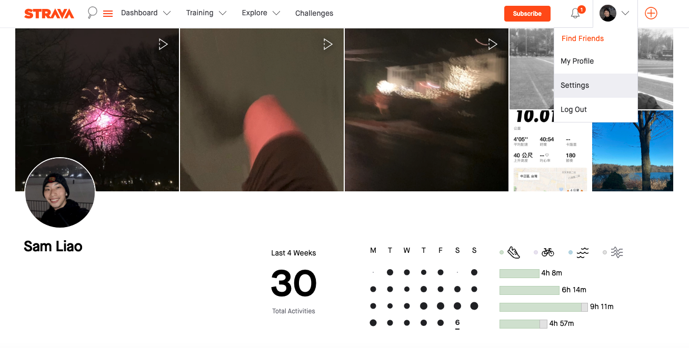
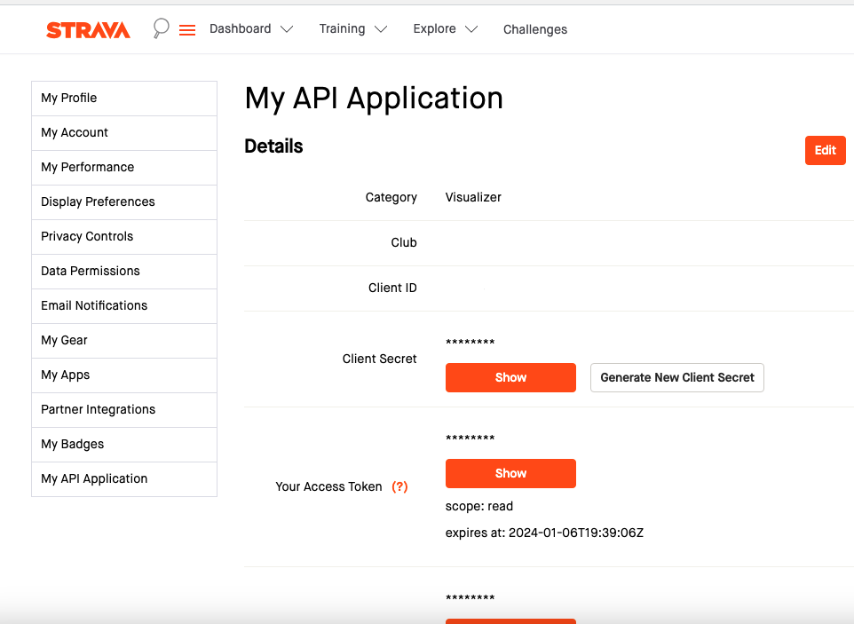

# Strava Calendar API

<em>The API enpowers the Strava Calendar application</em>

## Why do I build this project?

Strava Calendar API is the API that suppports Strava Calendar app to retrieve Strava personal data and plot the heatmap. It is implemented in Python Flask framework. The background of this project can be found at [Strava Calendar](https://github.com/handsamtw/strava-calender).

### Example

1. Generate User ID

   Endpoint

   - URL: /uid
   - Method: GET

   Parameters

   - code (Query Parameter): Authorization code obtained from the redirect URL.

   Description

   While interacting with [Strava Calendar](https://github.com/handsamtw/strava-calender) app, users initiate the authorization process by clicking on the  button.

   This grants the application READ ALL access to their public Strava activities. Subsequently, Strava provides a code, which is utilized to request an `access_token` and `refresh_token`. The GET /uid endpoint is designed to store these credentials in the database and return a unique user identifier (ObjectID) for future reference.

   Response

   - Success (HTTP 200 OK):
     Content Type: JSON
     - Body: { "uid": "<user_id>" }
   - Failure (HTTP 400 Bad Request):
     - Body: "No code is found in the redirect URL. Access_token request denied" (if no code is provided)
     - Body: "credentials is not an instance of dict.\n Credentials:{credentials}" (if credentials is not a dictionary)

2. Generate Strava calendar

   Endpoint

   - URL: /calendar
   - Method: GET

   Parameters

   - uid (Query Parameter): User ID obtained from the /uid endpoint.

   Optional Parameters:

   | Optional Parameters | Options                                                   | Description                                          |
   | ------------------- | --------------------------------------------------------- | ---------------------------------------------------- |
   | `theme`             | Reds (default), Blues, Greens, BuGn, PuBu, RdPu, twilight | Theme for the calendar                               |
   | `plot_by`           | distance (default), time                                  | The scale used to plot the calendar                  |
   | `as_image`          | True, False (default)                                     | Flag to determine if the response should be an image |

   Description

   The endpoint grab the `access_token` requested before from database with provided uid -> check the token expiracy and refresh if required -> fetch strava activity -> plot calendar with given configuration

   Response

   - Success (HTTP 200 OK):
     If as_image is set to true:

     - Content Type: image/png
       Body: PNG image data
       Otherwise:
     - Content Type: JSON
     - Body: Array of encoded images or error message.

   - Failure (HTTP 400 Bad Request):

     - Body: "User id must be provided" (if no user ID is provided)
     - Body: "Invalid user id: {uid}" (if the provided user ID is invalid)
     - Body: "User wasn't found in the database. Check Strava authorization status" (if user not found in the database)
     - Body: "No activities found within the period" (if no activities found)

## Running for development locally

To setup up locally devloping environment of this backend API, here is the todo list

- [ ] Fork the repo and clone your forked repo to local environment
- [ ] Install Python dependencies
- [ ] Setup MongoDB Atlas
- [ ] Setup Strava developer credentials
- [ ] Add .env file to the root directory
- [ ] Run locally and make a curl request

### Install Python dependencies

cd to project's root directory, and run `pip install`

### Setup MongoDB Atlas

1. Login to your MongoDB Atlass portal
2. Create New Organization(optional)
3. Create New Project within the organization
4. Navigate to Database at the left sidebar and click `Build a database`

5. Choose the M0 Free version and the region that is closest to your geological location
   
6. When MongoDB processes your request, add Username and Password to authenticate your connection with MongoDB. In addition, add entries to your IP Access List (Only an IP address you add to your Access List will be able to connect to your project's clusters)
7. After your cluster is built up, click `connect button`, visit Drivers tab and select Python as programming language
   

8. Follow the instruction you saw, copy somthing like `mongodb+srv://<Your username>:{your password}@cluster0.<cluster name>.mongodb.net/?retryWrites=true&w=majority` and replace line around 32 in api/index.py with your own credential
   

9. Navigate to database tab, click `browse collection`, and create your collection
   

10. After you create your database and collection, you might find the name mismatch between yours and mine at around line 40 in api/index.py. Change it to yours if needed.

### Setup Strava developer credential

To make request to Strava API, there're three critical credential: CLIENT_ID, CLIENT_SECRET, ACCESS_TOKEN
If you are a Strava user, you can login to your Strava account and hover to your icon at the top-right corner, click [settings](https://www.strava.com/settings/profil).

Click [My API application](https://www.strava.com/settings/api) at the last tab of left sidebar. Once you create your application, Strava will grant you devloper Client ID, Client Secret, and access token, which you will use later in .env file

### Add .env file to the root directory

The .env.example serves as a template for developers to understand the required environment variables without exposing any sensitive data.

Replace ACCESS_TOKEN, REFRESH_TOKEN, and MONGODB_PASSWORD in .env.example file to your own credential. Then run `mv .env.example .env` to rename the file

## How to Contribute

Before making PR request, please

- Run `pytest tests` ensuring all test cases pass
- Run `pylint ./**/*.py` ensuring the score is above 7/10. It would be great if you
  can also help out on improving the score

## Design documentation

### User flow

### Image Generation flow

